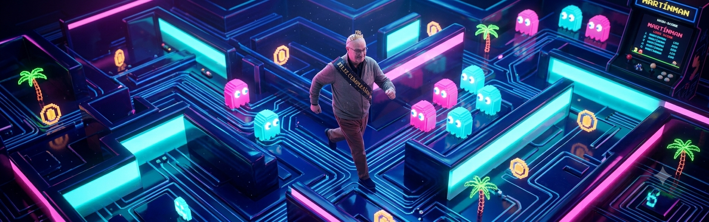

# PacMan3D

<!--
==============================================================================
Description: Main documentation file for the PacMan3D project.
Author: Enrique González Gutiérrez
Email: enrique.gonzalez.gutierrez@gmail.com
==============================================================================
-->

## Overview
**PacMan3D** is a modern 3D reimagining of the classic arcade game, built entirely from scratch using **Godot 4**. 

Currently in **Phase 1**, this project focuses on robust core mechanics, physics-based movement, and dynamic level generation using JSON files. The visual aesthetic relies purely on Godot's primitive 3D meshes (Spheres, Capsules, and Cubes) paired with vibrant colors and lighting to create a clean, minimalist, and highly playable prototype.

## Features (Phase 1)
*   **JSON-Based Level Generation:** Mazes are generated dynamically at runtime from structured JSON grid data.
*   **Physics-Based Entities:** Smooth movement and collision detection using Godot 4's 3D physics engine (`CharacterBody3D`, `Area3D`, `StaticBody3D`).
*   **Primitive 3D Art Style:** 
    *   Player: Yellow Sphere.
    *   Ghosts: Colorful Capsules (Red, Pink, Cyan, Orange).
    *   Maze: Blue Cubes.
*   **Core Loop:** Pellet collection, Power Pellets (invincibility state), basic Ghost AI (chase and frightened states), and score/lives tracking.

## Project Structure
*   `/assets/` - UI images, icons, and non-engine assets.
*   `/data/` - JSON files containing the level layouts.
*   `/materials/` - Standard 3D materials (colors) for the primitives.
*   `/scenes/` - Godot scene files (`.tscn`).
*   `/scripts/` - GDScript files (`.gd`), handling all game logic.

## Author
*   **Name:** Enrique González Gutiérrez
*   **Email:** enrique.gonzalez.gutierrez@gmail.com